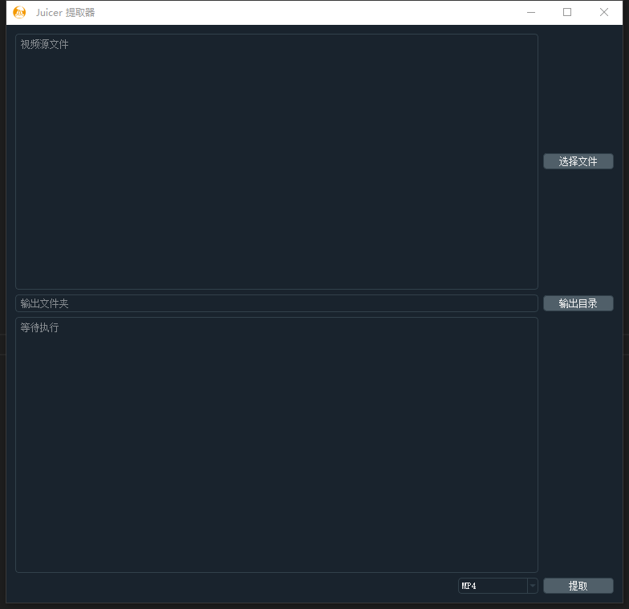

#  Jucicer extractor

想在专业剪辑软件里面拉片、自动分割镜头，但是想想硬盘里面一堆mkv高清片源不能导入，就立即被劝退。

Jucicer extractor 是应楚老师的需求，将.mkv文件中的视音频直接重新打包到mp4文件中，以便给Adobe Premiere，Davinci Resolve等专业软件使用，而不需要转码，破坏画面。

主流的转码软件再次编码的时候，如4K、h265、10 bit还是HDR，不仅编码时间久，效率低，并且对高画质（10bit 、HDR）、音频（杜比）等都会再次编码降低质量，甚至出错。

Jucicer extractor 仅仅使用文件封装技术，支持多线程，几乎不耗CPU和显卡性能，瓶颈主要在磁盘IO性能，以及少量内存。即使是普通笔记本，速度也可以达到30X-80X，甚至160X以上。

##  其他注意

没有限制多线程数量，多文件同时打包的时候注意观察计算机性能，特别是磁盘性能。

写文件使用了覆盖模式，在源视频和目标视频后缀相同的情况下，输出目录千万不能与源文件相同。

GUI使用PyQT5

编解码使用了开源的ffmpeg

输出mov文件，需要注意quicktime player不支持某些特定编码和封装

TrueHD 7.1转Eac3 5.1

保留杜比Atmos音频

### 主程序界面

### Windows操作系统进程情况

### 新改界面

